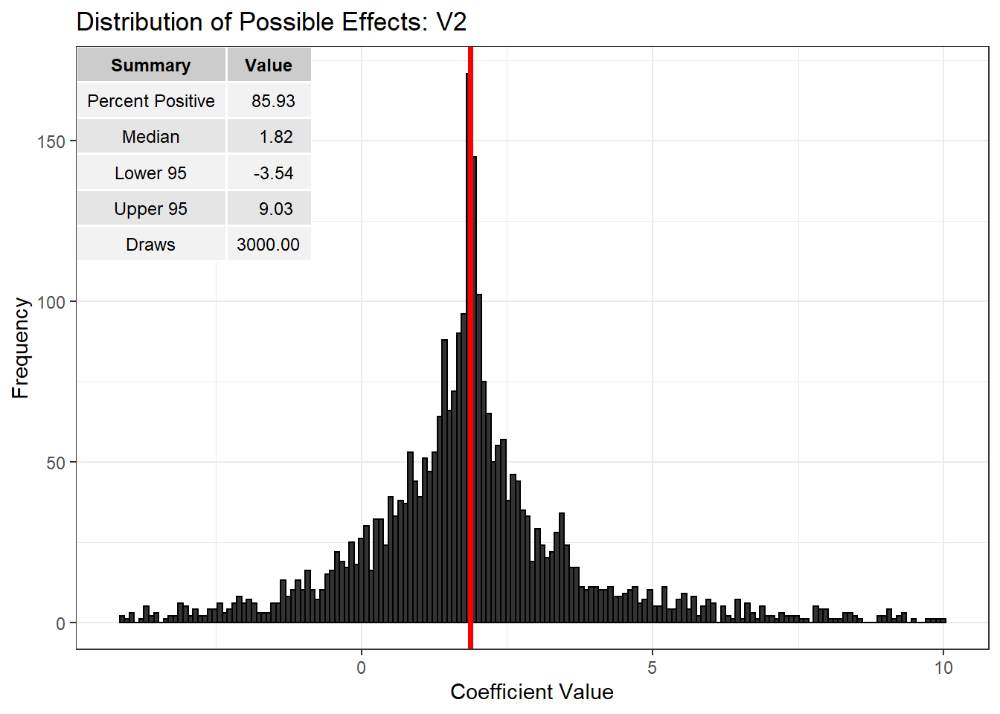

Distributions of Possible Effects
================

<!-- README.md is generated from README.Rmd. Please edit that file -->

### Why should I use it?

The threat of endogeneity is ubiquitous within applied empirical
research. Regressor-error dependencies are a common inferential concern
not in the least because they may arise from any combination of omitted
variable, systematic measurement errors, self selection, systematic
missing data, reciprocal causation, or interference between units.
Conventional statistical methods do not reflect any source of
uncertainty other than random error and so do not express these
additional doubts. The package impliments a “near Bayesian” method of
sensitivity analysis which samples uniformly from the set of valid
control functions to build a distribution of possible causal effects as
well as graphical tools for assessing the sensitivity of one’s results
to the threat of hidden biases.

### How do I get it?

Until the package is released on CRAN you can install the developmental
version of the package with the following lines of code:

``` r
Sys.setenv("R_REMOTES_NO_ERRORS_FROM_WARNINGS"=TRUE)
devtools::install_github("christophercschwarz/DOPE",
                         dependencies=TRUE)
library(DOPE)
```

### How do I use it?

The DOPE algorithm is built upon linear regression targeting uncertainty
in the ATE. The approach can be extended to semi-parametric
distributional regression models, possibly including random effects, for
various estimands with relative ease utilizing whitening and
augmentation tricks to put the models in OLS form.

To illustrate a number of functions from the package, let’s look at a
simulated example. First, let’s generate a random correlation matrix,
generate some data, and run a linear model.

``` r
x_vars <- 5
n_obs <- 1000
corm <- RandomCormCPP(nvars = x_vars)
X_mat <- MASS::mvrnorm(n_obs, rep(0,x_vars), Sigma = corm, empirical = TRUE)

betas <- 1:x_vars

y <- X_mat %*% betas + rnorm(n_obs, 0, 1)

dat <- data.frame(y,X_mat)

mod <- lm(y ~ ., data=dat)
summary(mod)
## 
## Call:
## lm(formula = y ~ ., data = dat)
## 
## Residuals:
##     Min      1Q  Median      3Q     Max 
## -3.2020 -0.6643 -0.0139  0.6630  3.5428 
## 
## Coefficients:
##             Estimate Std. Error t value Pr(>|t|)    
## (Intercept)  0.02674    0.03155   0.848    0.397    
## V1           1.34060    0.16671   8.041 2.51e-15 ***
## V2           1.86570    0.09118  20.462  < 2e-16 ***
## V3           3.24711    0.12102  26.831  < 2e-16 ***
## V4           4.07559    0.20809  19.586  < 2e-16 ***
## V5           4.98410    0.20964  23.775  < 2e-16 ***
## ---
## Signif. codes:  0 '***' 0.001 '**' 0.01 '*' 0.05 '.' 0.1 ' ' 1
## 
## Residual standard error: 0.9978 on 994 degrees of freedom
## Multiple R-squared:  0.9843, Adjusted R-squared:  0.9842 
## F-statistic: 1.242e+04 on 5 and 994 DF,  p-value: < 2.2e-16
```

Since we have control over the process by which the data was generated
we know that the model is correct and that the coefficients are
unbiased/consistent estimates of the treatment effect of interest.
Suppose, however, that we did not. We can take draws from the set of
valid control functions to build out a distribution of possible effects
reflecting ignorance of the regressor-error dependency plaguing our
analysis. The number of draws can be set with `nsims` and the number of
cores for parallel computation with `n.cores`.

``` r
dope <- DOPE(mod, nsims = 3000, n.cores = parallel::detectCores())
```

The result is a dataframe of `nsims` + 1 observations with columns for
each of the estimated coefficients, the control function coefficient,
and model R-squared. The last observation simply re-states the results
from the naive model for use in plotting functions. The most basic plot
shows the simulated distribution of possible effects and gives a number
of useful summaries. Because these are `ggplot` objects, that can be
easily modified by adding additional layers.

``` r
plot_DOPE(dope,"V2") + ggtitle("Distribution of Possible Effects: V2")
```



In this example, 86.27% of the estimated
