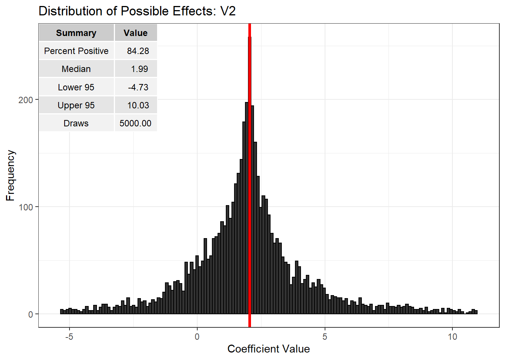
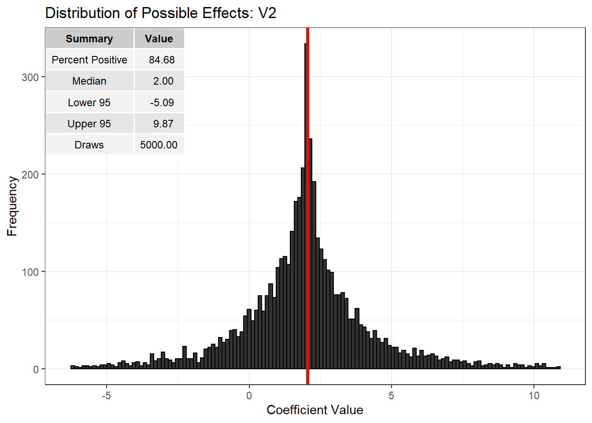
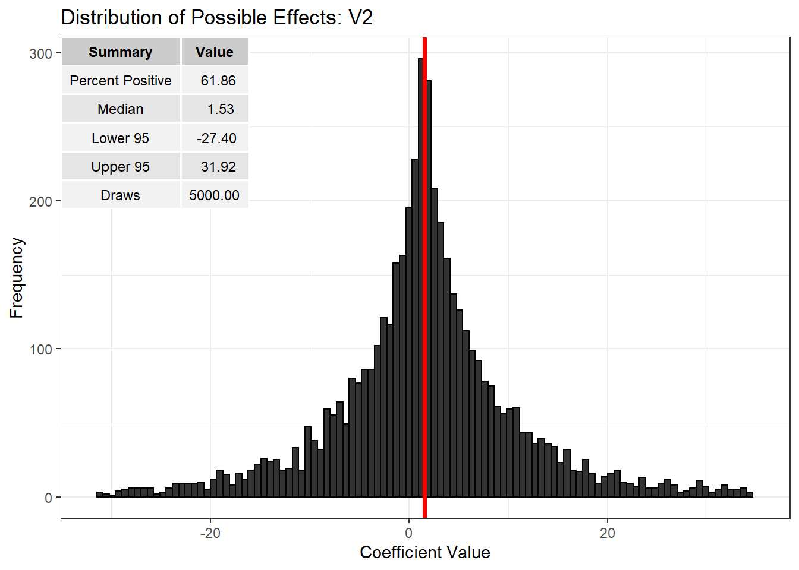
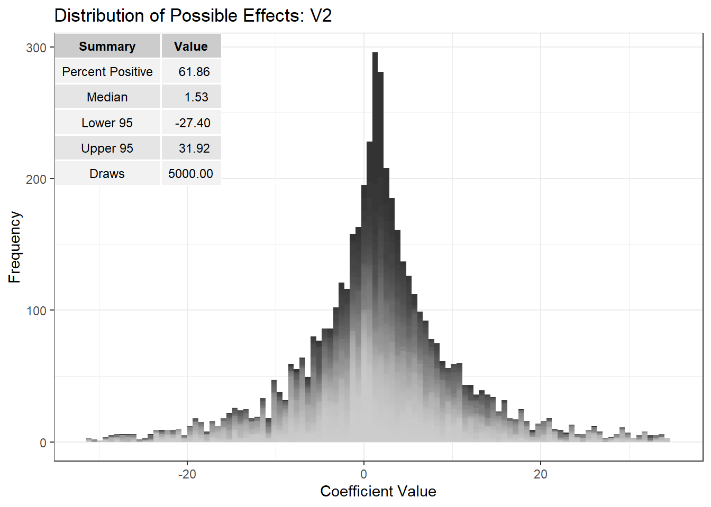
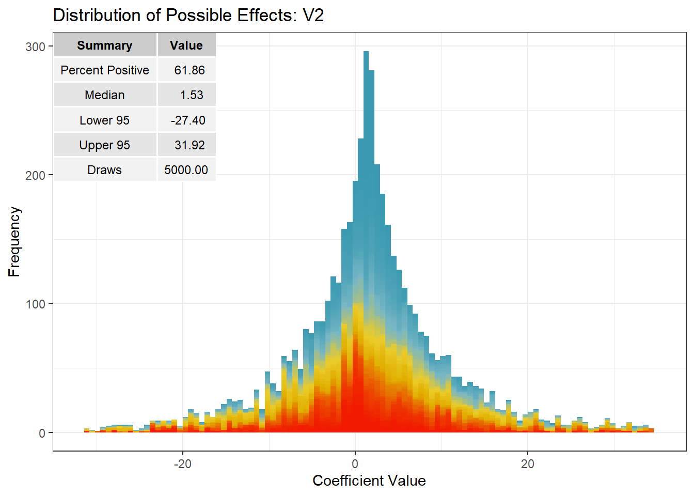

Distributions of Possible Effects
================

<!-- README.md is generated from README.Rmd. Please edit that file -->

### Why should I use it?

The threat of endogeneity is ubiquitous within applied empirical
research. Regressor-error dependencies are a common inferential concern
not in the least because they may arise from any combination of omitted
variable, systematic measurement errors, self selection, systematic
missing data, reciprocal causation, or interference between units.
Conventional statistical methods do not reflect any source of
uncertainty other than random error and so do not express these
additional doubts. The package impliments a “near Bayesian” method of
sensitivity analysis which samples uniformly from the set of valid
control functions under ignorance to build a distribution of possible
causal effects. The package provides graphical tools for assessing the
sensitivity of one’s results to the threat of hidden biases.

### How do I get it?

Until the package is released on CRAN you can install the developmental
version of the package with the following lines of code:

``` r
Sys.setenv("R_REMOTES_NO_ERRORS_FROM_WARNINGS"=TRUE)
devtools::install_github("christophercschwarz/DOPE",
                         dependencies=TRUE)
library(DOPE)
```

### How do I use it?

The DOPE algorithm is built upon linear regression targeting uncertainty
in the ATE. The approach can be extended to semi-parametric
distributional regression models, possibly including random effects, for
various estimands with relative ease utilizing whitening and
augmentation tricks to put the models in OLS form.

To illustrate a number of functions from the package, let’s look at a
simulated example. First, let’s generate a random correlation matrix,
generate some data, and run a linear model.

``` r
set.seed(8675309)
x_vars <- 5
n_obs <- 1000
corm <- RandomCormCPP(nvars = x_vars)
X_mat <- MASS::mvrnorm(n_obs, rep(0,x_vars), Sigma = corm, empirical = TRUE)

betas <- 1:x_vars

y <- X_mat %*% betas + rnorm(n_obs, 0, 1)

dat <- data.frame(y,X_mat)
cov(dat)
##            y         V1         V2         V3         V4         V5
## y  96.249064  8.2893844 -3.2385370  5.9116955  8.1197634  8.6556218
## V1  8.289384  1.0000000 -0.6810327  0.5393754  0.7133123  0.8364409
## V2 -3.238537 -0.6810327  1.0000000 -0.6527605 -0.1538645 -0.3959848
## V3  5.911695  0.5393754 -0.6527605  1.0000000  0.3200147  0.4794690
## V4  8.119763  0.7133123 -0.1538645  0.3200147  1.0000000  0.5489857
## V5  8.655622  0.8364409 -0.3959848  0.4794690  0.5489857  1.0000000
```

The lower V1-V5 sub-matrix is a draw from the set of valid correlation
matrices by repeatedly applying the DOPE augmentation algorithm. Within
the context of regression, what we will do is take the observed
covariance matrix as given and draw an additional row and column from
the set of valid covariance matrices, calculate quantities of interest,
and repeat. To begin, let’s estimate the linear model:

``` r
mod <- lm(y ~ ., data=dat)
```

Since we have control over the process by which the data was generated
we know that the model is correct and that the coefficients are
unbiased/consistent estimates of the treatment effect of interest.
Suppose, however, that we did not. We can take draws from the set of
valid control functions to build out a distribution of possible effects
reflecting ignorance of the regressor-error dependency plaguing our
analysis. The number of draws can be set with `nsims` and the number of
cores for parallel computation with `n.cores`.

``` r
dope <- DOPE(mod, nsims = 3000, n.cores = parallel::detectCores())
```

The result is a dataframe of `nsims` + 1 observations with columns for
each of the estimated coefficients, the control function coefficient,
and model R-squared. The last observation simply re-states the results
from the naive model for use in plotting functions. The most basic plot
shows the simulated distribution of possible effects and gives a number
of useful summaries. Because these are `ggplot` objects, that can be
easily modified by adding additional layers.

``` r
plot_DOPE(dope,"V2") + ggtitle("Distribution of Possible Effects: V2")
```



In this example, based upon 3000 draws 84.23% of the estimated effects
are greater than zero with a 95% credible interval of -4.58 to 9.13. The
naive estimate is indicated in red. Because these quantities are
generated from random draws it is always a good idea to set a seed,
although they stabalize with a larger amount of random draws.

We can get a little bit more information from the plot by shading based
upon the R-squared from each regression and turning off the naive
result.

``` r
plot_DOPE(dope,"V2",shade=T,include_naive = F) + ggtitle("Distribution of Possible Effects: V2")
```



Lighter shades indicate lower R-squared than darker shades, given a
sense for how fits are distributed across the effect values. This is
important as the distribution of possible effects changes as a function
of the allowable R-squared. If we wanted to change the color away from
greyscale we can add another layer like so:

``` r

plot_DOPE(dope,"V2",shade=T,include_naive = F) + ggtitle("Distribution of Possible Effects: V2") + scale_fill_discrete()
```



If there is a particular color palette you are looking for you can use
it using something like the following.

``` r
library(wesanderson)

p <- plot_DOPE(dope,"V2",shade=T,include_naive = F) + ggtitle("Distribution of Possible Effects: V2") 

st <- try(ggsave("not_actually_output.pdf",p + scale_fill_manual(values = "black")),silent=T)
n_fills <- as.numeric(regmatches(st,gregexpr("[[:digit:]]+",st))[[1]][1])

p + scale_fill_manual(values=colorRampPalette(wes_palette("Zissou1"))(n_fills))
```



We can get a sense for how the distribution of possible effects changes
with restrictions on the R-squared with a `sensitivity_plot`.

``` r
sensitivity_plot(dope,"V2")
```



The solid dots indicate how the certainty in the effect changes as you
say “the world is not that deterministic,” reducing the maximum
allowable R-squared. This reduces uncertainty relative to ignornace,
indicated by the dashed line, at the cost of restrictiveness, indicated
by the hollow points. In the other direction, one might say that “the
world is more deterministic than reflected in my model.” This is
represented by the crossed points and increases uncertainty until the
lower pessimistic bound on effect certainty. The proportion of draws
rejected by this lower thresholding is given by the filled diamonds.
